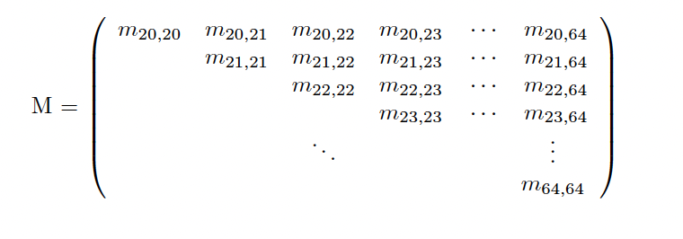

# 1. Data

The labor earnings data are drawn from the first 26 waves of PSID covering the period from 1968 to 1993.

- The input STATA data file "ready_newdata.dta" essentially contains variables from the PSID's website. No sample cleaning or selection has been done up to this point. 


## 1.1 Variable Definitions
**_Age of the head_** is constructed by taking the first report of age by the individual and by adding the necessary number of years to obtain the age in other years (variable name V16631 in 1989).        
   - This is done to eliminate the occasional non-changes or two-year jumps in the age variable between consecutive interviews as a result of interviews not being conducted exactly one year apart. 
    
**_Head's total labor income_** measure is comprehensive and includes salary income, bonuses, overtime, commissions, and the labor part of farm, business, market gardening, and roomers and boarders income, as well as income from professional practice or trade (variable name V17534 in 1989).     

**_Annual labor hours_** of the head is the self-reported annual hours worked by the individual (variable name V16335 in 1989).   

**_Head's average hourly earnings_** is calculated by the PSID as the ratio of total labor income to annual labor hours (variable name V17536 in 1989).     

**_Education_** is based on the categorical education variable in the years it is available (variable name V17545 in 1989), and on years of schooling completed when this variable was not available (variable name V30620 in 1989).      
   - Potential labor market experience is constructed from this latter variable.       

For more info on PSID variables, pls refer to [The PSID Data Custom Codebook](https://www.colby.edu/economics/faculty/mrdonihu/activesaving070506/job54061.pdf).


## 1.2 Selection Criteria
An individual is included into the sample he satisfies the following criteria for a total of twenty (not necessarily consecutive) years between 1968 and 1993.       

The individual   
(i) is a `male head of household`,     
(ii) is `between 20 and 64 years old (inclusive)`,     
(iii) is not from the SEO sample (which oversamples poor households),    
(iv) has `positive hours and labor income`,     
(v) has hourly labor earnings more than $W$<sub>$min$</sub> and less than $W$<sub>$max$</sub>, where we set $W$<sub>$min$</sub> to <span>$</span>2 and $W$<sub>$max$</sub> to \$400 in 1993 and adjust them for previous years using the average growth rate of nominal wages obtained from BLS,     
(vi) worked for `more than 520 hours (10 hours per week)` and `less than 5110 hours (14 hours a day, everyday)`.     

These criteria leave us with our main sample of 1270 individuals with at least twenty years of data on each.      


## 1.3 Data Cleaning
- Set initial conditions

```shell
sysuse auto, clear

use "/Users/jingjiexu/Desktop/509 earnings estimation/Earnings estimation/Ready_newdata/ready_newdata.dta"

gen Tinit=67
gen Tlast=96
gen ageinit=20
gen agelast=64
gen minyrs=20

```

- Imputing missing Grades Variable in the years 70-74

```shell

local i=94
while `i'<=97 {
     rename upedu`i'h grade`i'
     local i=`i'+1
}

replace grade72=edcn72
replace grade72=. if grade72>25
replace grade75=edcn75
replace grade75=. if grade75>25

gen grade69=0
replace grade69=grade68 if seqno68==1 & seqno69==1
replace grade69=grade72 if grade69==0 & seqno69==1 & seqno72==1

replace grade70=grade68 if seqno68==1 & seqno70==1
replace grade70=grade72 if grade69==0 & seqno70==1 & seqno72==1

replace grade71=grade70 if seqno70==1 & seqno71==1
replace grade71=grade72 if grade71==0 & seqno71==1 & seqno72==1

replace grade73=grade72 if seqno72==1 & seqno73==1
replace grade73=grade75 if grade73==0 & seqno73==1 & seqno75==1

replace grade74=grade72 if seqno72==1 & seqno74==1
replace grade74=grade75 if grade74==0 & seqno74==1 & seqno75==1

```

- Removing missing observations in grades

```shell

local i=Tinit+1
while `i'<=Tlast+1 {
     replace grade`i'=. if grade`i'>30
     local i=`i'+1
}

```

- awg: average growth rate of nominal wages
- Note: awg96==rawg96 by definition of 96 as base year

```shell

gen awg67=2.85
gen awg68=3.02
gen awg69=3.22
gen awg70=3.40
gen awg71=3.63
gen awg72=3.90
gen awg73=4.14
gen awg74=4.43
gen awg75=4.73
gen awg76=5.06
gen awg77=5.44
gen awg78=5.87
gen awg79=6.33
gen awg80=6.84
gen awg81=7.43
gen awg82=7.86
gen awg83=8.19
gen awg84=8.48
gen awg85=8.73
gen awg86=8.92
gen awg87=9.13
gen awg88=9.43
gen awg89=9.80
gen awg90=10.19
gen awg91=10.50
gen awg92=10.76
gen awg93=11.03
gen awg94=11.32
gen awg95=11.64
gen awg96=12.03

```

- Real wage rate = average growth rate of nominal wages / price level
- Remove workers earning very low wages and very high wages per hour
- Restricted to workers working no less than 520 and no more than 5110
- Remove those who worked but have 0 labor income and those who never worked but have positive labor income. Only keep observations with positive hours and labor income.
- rhdlbin: real household labor income


```shell

local i = Tinit-1
while `i' < Tlast {
       local i=`i'+1
       gen rawg`i'=awg`i'/prc`i'
       replace rhdlbin`i'=. if rhdwg`i'<=(2*rawg`i'/awg96) | rhdwg`i'>(400*rawg`i'/awg96) | hwkhrs`i'>5110 | hwkhrs`i'<520
       replace rhdlbin`i'=. if rhdlbin`i'==0 & hwkhrs`i'>0
       replace rhdlbin`i'=. if rhdlbin`i'>0 & hwkhrs`i'==0
}  

```


- Generating dummy variables for families with head aged AGEINIT to AGELAST, with male head of family    

- Following the bulk of the existing literature, the measure of labor market experience of an individual use is “potential” experience defined as (age − max(years of schooling, 12) − 6). 
   - Although, ideally, it would be preferable to use a measure of actual experience, constructing a reliable measure using PSID data is not straightforward because it requires either observing individuals for all years since they enter the labor market which would substantially reduce the sample size or relying on retrospective questions that ask workers to recall how many years they have worked since entering labor market, which may not be reliable.


```shell

gen kept=0
local i = Tinit /*+1*/
while `i'<= Tlast {
      local i = `i'+1
      local ii = `i'-1
      /*-----------Identify people in the age groups--------*/
      gen agedum`i'=0
      replace agedum`i'=1 if agehd`i'>=ageinit & agehd`i'<=agelast
      /*--------- Identify head of households------------- */
      gen seqdum`i'=0
      replace seqdum`i'=1 if seqno`i'==1
      /*------------------Identify sex of the head of household---------- */
      gen sexdum`i'=0
      replace sexdum`i'=1 if sexhd`i'==1
      /* -------------Identify if labor income is positive in that year------------*/
      gen labdum`ii'=0
      replace labdum`ii'=1 if rhdlbin`ii'>0 & rhdlbin`ii'~=.

       replace kept=kept+agedum`i'*seqdum`i'*sexdum`i'*labdum`ii'

      gen lnrhdlbin`ii'=ln(rhdlbin`ii')
      gen expr`i'=agehd`i'-max(grade`i',12)-6

}

```


- This will have at least 'minyrs' years of datapoint for each surviving person, but not necessarily consecutive 20 years

```shell

drop if kept < minyrs

```

- Drop any remaining unusable variables
- Number each observation with an id number

```shell

drop educ* prc* rawg* awg* upedu*
aorder

/*-----------The sequence no. of each observation--------*/
gen idno = _n
/*-----------Number of observations left--------*/
gen k = _N 
display k

```
    
Convert the original wide data into a standard long data，and transform the long data into a panel data:

<div align=center>
	&nbsp &nbsp  &nbsp &nbsp &nbsp &nbsp 

</div>

- Convert data into long form for panel implementation      

```shell

reshape long age agehd agedum expr hdedcn hdlbin hdwg rhdwg grade hwkhrs id labdum rhdlbin lnrhdlbin numfam relh seqdum seqno sexdum sexhd, i(idno) j(year)

drop if year < Tinit | year==67
drop if year > Tlast

tsset idno year

```

- Generate year dummies

```shell

tab year, gen(yrdum)
local i=0
local j=Tinit
while `i' < (Tlast-Tinit) {
      local i = `i'+1
      local j = `j'+1
      rename yrdum`i' yrdum`j'
} 

```

# 2. Estimation based on a time-invariant model (Storesletten, Telmer and Yaron (2004))
## 2.1 Residuals

The first step is to remove the predictable component of labor earnings and then specify a process for residual earnings.

where   
$Y$<sub>$i,j,t$</sub>: measured annual disposable labor income of individual $i$ of age $j$ in period $t$   
$w$<sub>$t$</sub>: wage per efficiency unit of labor  
$h$<sub>$t$</sub>: number of hours worked     
$e$<sup>$f$(X<sub>$i,j,t$</sub>)</sup>: predictable individual labor efficiency   
$X$<sub>$i,j,t$</sub>: demographic observable and predictable variables (age, gender, education, time dummy, etc.)    
$y$<sub>$i,j,t$</sub>: stochastic component of earnings   
$f$: time invariant function of observables $X$<sub>$i,j,t$</sub>  		


Take logs in the equation above, we get

Run a gression and we obtain residuals *y<sub>i,j,t</sub>*. We now need to specify a structure for these residuals.

The statistical model for residual *log* earnings is following a time-invariant model

where $\alpha$, $\epsilon$ and $v$ are assumed to be uncorrelated and have zero mean. The paramerters to be estimated are:


**Identification** Cross sectional moments between agents of age $j$ and $n$. In particular, the covariance of residual earnings between age $j$ and $j+n$ individuals, $m$<sub>$j,n$</sub>


- Generate residuals

```shell

quietly reg lnrhdlbin agehd expr yrdum* if seqno*labdum*agedum*sexdum==1 
predict resid, residuals

local j=ageinit
	 while `j'<= agelast{
	 	gen resid`j'=.
		replace resid`j'=resid if seqno*labdum*agedum*sexdum==1 & agehd ==`j' /*---For those who satisfies the selection critiria, we label individual residuals at each age--*/ 
		
		local k=0
		while `k'<=`j'-ageinit{
			
			gen resid`j'f`k'=.   
			replace resid`j'f`k'=f`k'.resid`j'  /*---Performing forward time series operation to get variables such that we can calculate covariances--*/
	
		local k=`k'+1	
	}
		
	 local j = `j'+1
}

```


## 2.2 Empirical moments

Constrcut a matrix $M$ containing empirical moments:

<div align=center>
			
</div>


- Initialize $M$ as a square matrix containing zeros

```shell

local d = agelast-ageinit+1  //45
matrix M_Utri = J(`d',`d',0)  

```

- Filling the upper triangle of $M$

```shell

local j=ageinit
	 while `j'<= agelast{

			local n=0
			while `n'<=agelast-`j'{
				
				local jn=`j'+`n'
				
				egen countobs_for_resid`jn'f`n' = total(!missing(resid`jn'f`n'))
				/*For some resid`jn'f`n', there may be no observations becasue there are no such n years apart records. For example for age group 64 years old, there are no more than 28 non-concecutive records. That's why the northeast and southeast of matrix M are missing*/
									
				if countobs_for_resid`jn'f`n' ~= 0 {
					matrix accum m=resid`j' resid`jn'f`n',noconstant deviations
					matrix m=m/(r(N)-1)  //sample covariances
					matrix M_Utri[`j'-(ageinit-1),`jn'-(ageinit-1)]=m[1,2]  //ageinit=20
				}
				
				else if countobs_for_resid`jn'f`n' == 0{
				matrix M_Utri[`j'-(ageinit-1),`jn'-(ageinit-1)]=.  //ageinit=20	
				}
					
			local n=`n'+1	
		}
	
	local j = `j'+1
}

```

- Filling the lower triangle of $M$
- Note that M is symmetric so we can use math to filling the lower triangle

```shell

mat M_Ltri=M_Utri'
mat M =M_Utri+M_Ltri
mat l M,nohalf
svmat M

keep M*
export excel using "/Users/jingjiexu/Desktop/Earnings_Estimation_Jingjie/M.xlsx", sheet("M") firstrow(variables)

```

- $M$ is a $(45*45)$ symmetric matrix containing empirical moments (variances and covariances of residual earnings) with its northeast and southwest missing:

<div align=center>
			
</div>


## 2.3 Theoretical Moments
Constrcut a matrix $\hat{M}$ containing theoretical moments:

<div align=center>
			
</div>

The matrix containing theoretical moments is also symmetric and as follow (referring to $eq (5)$ and $eq(6)$) under the assumption that the idiosyncratic components are transitory (i.i.d.) shocks:

<div align=center>
			
</div>

Note that matrix $\hat{M}$ is a symmetric toeplitz matrix. We can use the function in MatLab to construct it. And then vectorize it.
And then we can define the objective function-the distance between empirical and theoretical matrices.		

There are two programs: we first define the objective function 'myfun' containing 4 paramers rho, var_a, var_e, var_v, and then recall 'myfun' in the main program.

```shell

function myobj=myfun(params)

global M_vectorized

rho=params(1);
var_a=params(2);
var_e=params(3);
var_v=params(4);


%%%%%%%%%%%%%%%%%%%%%%%Construct a matrix M_hat containing theoretical moments%%%%%%%%%%%%%%%%%%%%%%%%%%%%%%%%%%%%%%%%%%%%%%%%%%%%%%%%%%%%%%%%%%%%%%%%%%
r=[var_a+var_e+var_v var_a+rho*var_v var_a+rho^2*var_v var_a+rho^3*var_v var_a+rho^4*var_v var_a+rho^5*var_v var_a+rho^6*var_v var_a+rho^7*var_v var_a+rho^8*var_v var_a+rho^9*var_v var_a+rho^10*var_v var_a+rho^11*var_v var_a+rho^12*var_v var_a+rho^13*var_v var_a+rho^14*var_v var_a+rho^15*var_v var_a+rho^16*var_v var_a+rho^17*var_v var_a+rho^18*var_v var_a+rho^19*var_v var_a+rho^20*var_v var_a+rho^21*var_v var_a+rho^22*var_v var_a+rho^23*var_v var_a+rho^24*var_v var_a+rho^25*var_v var_a+rho^26*var_v var_a+rho^27*var_v var_a+rho^28*var_v var_a+rho^29*var_v var_a+rho^30*var_v var_a+rho^31*var_v var_a+rho^32*var_v var_a+rho^33*var_v var_a+rho^34*var_v var_a+rho^35*var_v var_a+rho^36*var_v var_a+rho^37*var_v var_a+rho^38*var_v var_a+rho^39*var_v var_a+rho^40*var_v var_a+rho^41*var_v var_a+rho^42*var_v var_a+rho^43*var_v var_a+rho^44*var_v];

M_hat=toeplitz(r);  %%r is the first row of M_hat
%%%%%%%%%%%%%%%%%%%%%%%%%%%%%%%%%%%%%%%%%%%%%%%%%%%%%%%%%%%%%%%%%%%%%%%%%%%%%%%%%%%%%%%%%%%%%%%%%%%%%%%%%%%%%%%%%%%%%%%%%%%%%%%%%%%%%%%%%%%%%%%%%%%%%%%%

%%Vectorize M_hat
M_hat_vectorized=M_hat(:);

%%Define the objective function
Diff=M_vectorized-M_hat_vectorized;
myobj=sum(Diff.^2);  %%Find the squares of each element, sum the squares in each column 

end

```

The objective function is displayed as a 30-page function. 1/60 of the objective function is shown below:

<div align=center>
			
</div>

Finally, perform the minimum distance estimation

```shell

clear all;close all;clc;

%%%%%%%%%%%%%%%%%%%%PERFORMS THE MINIMUM DISTANCE ESTIMATION%%%%%%%%%%%%%%%%%%%%%%%%%%%%%%%%%%%%%%%%%%%%%%%%%%%%%%%%%%%%%%%%%%%%%%%%%%%%%%%%%%%%%%%%%%%%
% THIS IS THE MAIN PROGRAM THAT PERFORMS THE MINIMUM DISTANCE ESTIMATION OF
% TRANSITORY INCOME SHOCKS.
% IT CALLES TWO FUNCTIONS NAMED loadMatrixM THAT NEEDS TO RESIDES IN THE SAME DIRECTORY AS THE CURRENT PROGRAM.
%%%%%%%%%%%%%%%%%%%%%%%%%%%%%%%%%%%%%%%%%%%%%%%%%%%%%%%%%%%%%%%%%%%%%%%%%%%%%%%%%%%%%%%%%%%%%%%%%%%%%%%%%%%%%%%%%%%%%%%%%%%%%%%%%%%%%%%%%%%%%%%%%%%%%%%%

M_vectorized = loadMatrixM;
global M_vectorized  

%% start with some initial guess X0
X0=[0,0,0,0,0];

%% Set options to obtain iterative display and use the 'quasi-newton' algorithm.
options = optimoptions(@fminunc,'Display','iter','Algorithm','quasi-newton');

%% fminunc is a toolbox provided by matLab to solve unconstrained minimization problems 
[params,Fval]=fminunc(@myfun,X0,options);

save RESULTS_ALL;

```
The main function iterate 2000 times and give the following result:
[Results](RESULTS_ALL.mat)

<div align=center>
<image src="github_pic/results.png" width=600 height=200>
</div>

$\rho=0.9637$, $\sigma^2_{\alpha}=-2.0131$, $\sigma^2_{\epsilon}=-0.2232$, $\sigma^2_{v}=6.8114$		

Interpretation: The shock is permanent.		

The main program is later modified by adding a zero lower bound for variances to limit them to be non-negative, and fmincon is therefore used.
	
```shell
	
clear all;close all;clc;

M_vectorized = loadMatrixM;

global M_vectorized

% Start with some initial guess X0
X0=[0,0,0,0,0];

% params has positive values
lb=[,0,0,0];
% The probelmhas no upper bounds
ub=[];

% The problem has no linear constraints , so set those arguments to []
A=[];
b=[];
Aeq=[];
beq=[];

% Use fmincon since it's a constrained problem now
params=fmincon(@myfun,X0,A,b,Aeq,beq,lb,ub);

% Display in the order of rho, var_alpha, var_epsilon, var_v
disp(params)

save RESULTS_ALL;
	
```

The program gives a resulting $\rho$=0.9331 which is a little bit smaller than the previous one but with non-negative variances $\sigma^2_{\alpha}=0$, $\sigma^2_{\epsilon}=0$, $\sigma^2_{v}=5.0318$.	
		
Let's see some results from Storesletten, Telmer and Yaron (2004):  		

The solid line is the cross-sectional variance of earnings, based upon PSID data 1969-1992 which we can refer to since we are focusing on 1969-1993. The resulting parameter values are $\sigma^2_{\alpha} + \sigma^2_{\epsilon}=0.2735$, $\sigma^2_{\eta}=0.0166$ and $\rho=0.9989$.


<div align=center>
			
</div>
		
## 2.4 A 4-year panel example 		
Use a (4*4) submatrix to solve for the minimizer. 		
The problem now is limited to a 4-year panel data, and we have the two matrices containing empirical moments and theoretical moments respectively as follow:		


<div align=center>
			
</div>

<div align=center>
			
</div>


- Construct matrix $M$ containing empirical moments and vectorize it:

```shell

/*----------A SUBMATRIX CONTAINING EMPIRICAL MOMENTS-----------*/
keep m20_20 m20_21 m20_22 m20_23 m21_20 m21_21 m21_22 m21_23 m22_20 m22_21 m22_22 m22_23 m23_20 m23_21 m23_22 m23_23

/*----------SAVE EACH ROW AS A MATRIX-----------*/
mkmat m20_*, matrix(R20) 
mkmat m21_*, matrix(R21) 
mkmat m22_*, matrix(R22)
mkmat m23_*, matrix(R23)

/*----------------HORIZONTALLY COMBINE THE MATRICES-------------------*/
matrix M = [R20\R21\R22\R23]
matrix list M

svmat M
outfile using M, nolabel replace wide

/*----------VECTORIZE THE MATRIX CONTAINING EMPIRICAL MOMENTS----------*/
mat M_vectorized = vec(M)
mat l M_vectorized

svmat M_vectorized
outfile using M_vectorized, nolabel replace wide

keep M_vectorized

```

```

export excel using "/Users/jingjiexu/Desktop/509 earnings estimation/Earnings estimation/M_and_M_vectorized.xlsx", sheet("M_and_M_vectorized") firstrow(variables)

```

We now have $M$ and $M_{vectorized}$ as:

<div align=center>
	
</div>

<div align=center>
					
</div>


- Construct matrix $\hat{M}$ containing theoretical moments and vectorize it:

```shell

clear all; close all; clc; % clear the workspace

%%%%%%Define the parameters
syms rho var_a var_e var_v  

%%%%%%Define the matrix containing teoretical moments
M_hat = [var_a+var_e+var_v var_a+rho*var_v var_a+rho^2*var_v var_a+rho^3*var_v;
         var_a+rho*var_v var_a+var_e+var_v var_a+rho*var_v var_a+rho^2*var_v;
         var_a+rho^2*var_v var_a+rho*var_v var_a+var_e+var_v var_a+rho*var_v;
         var_a+rho^3*var_v var_a+rho^2*var_v var_a+rho*var_v var_a+var_e+var_v];

%%%%%%Vectorize M_hat
M_hat_vectorized = M_hat(:);
disp(M_hat_vectorized);

%%%%%%Import M_vectorized as a column vector

```

We now have $\hat{M}$ and $\hat{M}_{vectorized}$ as:

<div align=center>

</div>


<div align=center>
					
</div>


- The objective function

```shell

%%%%%%Subtract one from the other
Diff = M_vectorized - M_hat_vectorized;

%%%%%%Set the weighting matrix to identitiy matrix for simplicity
W = eye(16);

%%%%%%Define the objective function
fun = Diff.' * W * Diff;

```

The objective function:

<div align=center>
					
</div>


- And the solver gives the results as follow:

<div align=center>
					
</div>


Intepretation:		
The earnings shock is not permanent since we are using a very short data.


# 3. README to run Dofiles, matLab programs and access the outputs
Download everything here:[ALLFILES](Earnings_Estimation_Jingjie.zip)  
	
Note: Keep all of the files under the same directory (folder). (I mean if you don’t move them after download they will definitely in the same folder.)

Step 1: Change the path at the beginning and the end to import the data and to save the results. Run the Stata Dofile named Generate_empirical_moments.do and you get a Excel spreadsheet with empirical moments. 		

Step 2: Run the matLab code called Perform_minimizing_distance.m and you will get a file called RESULTS_ALL.m.		

Step 3: Open RESULTS_ALL.m and check the results.		

You don’t need to run the other two matLab programs, they will automatically be recalled when you run the main program. Just for explanation, I’m describing them in the following paragraph.

There are three matLab programs, loadMatrixM.m is used to load the empirical moments generated by the Stata Dofile and used to create the vectorized matrix containing all empirical moments, which is matrix M.. myfun.m is used to define the objective function. Perform_minimizing_distance.m is the main program and the only one you need to run.


  


# Reference
[1] Guvenen, F., 2009. An empirical investigation of labor income processes. Review of Economic Dynamics 12, 58-79.     
[2] Guvenen, F., 2009. Code and data files for "An Empirical Investigation of Labor Income Processes".         
[3] Kjetil Storesletten, Christopher I.Telmer, Amir Yaron, 2004. Consumption and risk sharing over the life cycle. Journal of Monetary Economics 51, 609-633.        
[4] Salvador ortigueira. Lecture notes for "Estimation of earnings processes".             
